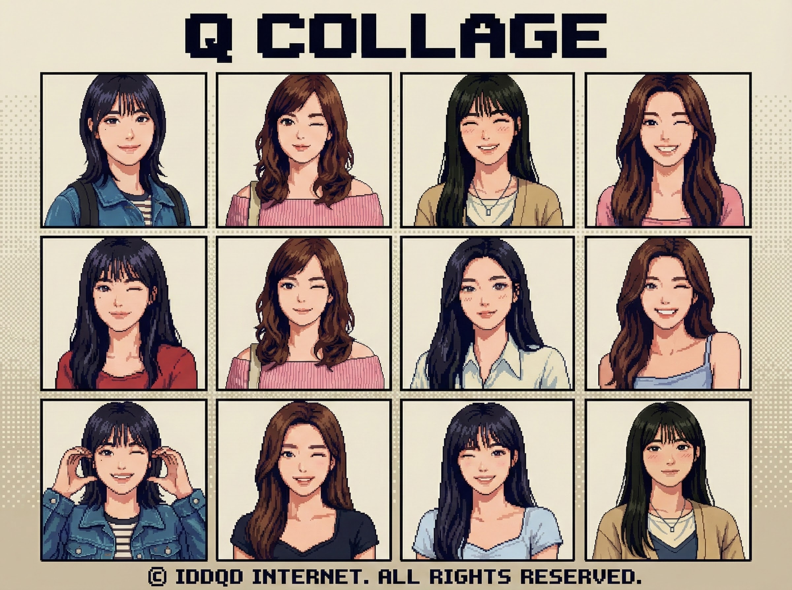

# Q Collage

[한국어](./README.ko.md)

A pure client-side image collage generator. Drag and drop multiple photos to automatically arrange them into a customizable grid. Adjust columns, rows, aspect ratios, and gutters in real-time, then download your creation as a high-resolution PNG or JPG. This tool handles high-resolution outputs up to 8192px width directly in your browser without any server uploads.

# Our Philosophy
IDDQD Internet builds zero-DB, zero-signup tools powered by pure HTML/JS for instant browser execution. Even with AI features, we keep it stateless and record-free.

# Link
- [Run Q Collage](https://app.iddqd.kr/collage/)
*(Runs instantly in browser)*

# Splash

# Features
- **Drag & Drop Interface**: Easily add multiple images at once.
- **Customizable Grid**: Adjust columns (1-50) and rows (1-50) to potential layouts.
- **Aspect Ratio Control**: Support for popular ratios like 1:1, 16:9, 4:3, and vertical formats.
- **Gutter Adjustment**: Fine-tune spacing between images with pixel-perfect precision.
- **High Resolution Output**: Render and download images up to 8192px wide.
- **Privacy Focused**: All processing happens locally in your browser; no images are uploaded to any server.
- **Format Options**: Export as PNG or JPG (Quality 80/100).
- **Shuffle**: Randomize image placement with a single click.

# Usage
1. Open the application in your web browser.
2. Drag and drop your images into the drop zone or use the file selection button.
3. Use the control panel on the left to adjust:
   - **Col/Row**: Number of columns and rows in the grid.
   - **Ratio**: The overall aspect ratio of the canvas.
   - **Gutter**: The white space between images.
   - **Total Size**: The resolution width of the final output.
4. Click **Shuffle** to rearrange images if desired.
5. Click **Download PNG** or **Download JPG** to save your collage.

# Tech Stack
- **Core**: HTML5, CSS3, JavaScript (ES6+)
- **Libraries**: jQuery 3.7.1, Bootstrap 5.3.3
- **Rendering**: HTML5 Canvas API for real-time composition and export.

# Contact & Author
Park Sil-jang
- Dev Team Lead at IDDQD Internet. E-solution & E-game Lead. Bushwhacking Code Shooter. Currently executing mandates as Choi’s Schemer.
- HQ (EN): https://en.iddqd.kr/
- GitHub: https://github.com/iddqd-park
